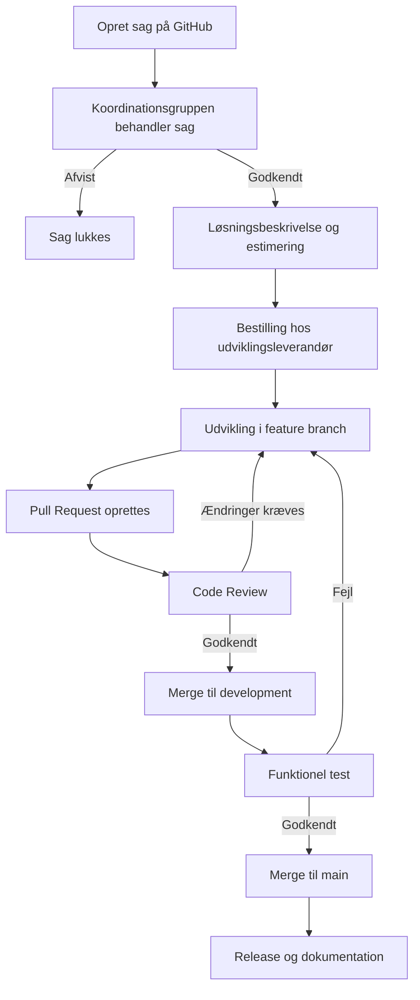

# Contributing to OS2BorgerPC

## Status
- [x] Udkast
- [ ] Godkendt af koordinationsgruppen - Dato:
- [ ] Godkendt af styregruppen - Dato:

## Kontekst
Dette dokument beskriver processen for kodebidrag til OS2BorgerPC’s kernekomponenter.

OS2BorgerPC anvender en flerleverandørstrategi, hvor flere uafhængige udviklingsleverandører kan bidrage til den samme kodebase. For at sikre kvalitet, sporbarhed og transparens følger alle kodebidrag en fælles proces baseret på *GitHub Flow*.

Repository-oversigt:
https://github.com/os2borgerpc

## OS2BorgerPC produktorganisering
OS2BorgerPC består af flere repositories. 
- Nogle repositories udgør produktkernen. Bidrag til dem skal følge retningslinjer i CONTRIBUTONG.md
- Nogle repositories rummer communnity contributions. Bidrag til disse er ikke underlagt faste retningslinjer.

### Repository oversigt

Klik for at se en fuld repository oversigt

    
### OS2BorgerPC produktkernen består af disse repos

- [**os2borgerpc-image**](https://github.com/OS2borgerPC/os2borgerpc-image) – Specialiseret Ubuntu Desktop distribution tilpasset offentligt tilgængelige arbejdsstationer i de danske kommuner.
- [**os2borgerpc-kiosk-image**](https://github.com/OS2borgerPC/os2borgerpc-kiosk-image) – Specialiseret Ubuntu Server distribution tilpasset storskærme og kiosk-løsninger i de danske kommuner.
- [**os2borgerpc-admin-site**](https://github.com/OS2borgerPC/os2borgerpc-admin-site) – Webbaseret system til administration af BorgerPC’er bygget på Django.
- [**os2borgerpc-client**](https://github.com/OS2borgerPC/os2borgerpc-client) – Python applikation, der installeres på BorgerPC’erne og kommunikerer med administrationssystemet.
- [**os2borgerpc-core-scripts**](https://github.com/OS2borgerPC/os2borgerpc-core-scripts) – Scripts til udvidelse og tilpasning af OS2BorgerPC-grundinstallationen.
- [**os2borgerpc-admin-site-urls**](https://github.com/OS2borgerPC/os2borgerpc-admin-site-urls) – Fælles konfiguration af URL’er på tværs af alle hostede instanser.
- [**os2borgerpc-admin-site-deployment**](https://github.com/OS2borgerPC/os2borgerpc-admin-site-deployment) – Deployment-kode og opsætning til automatisk udrulning af solutionens services.
- [**os2borgerpc-docs**](https://github.com/OS2borgerPC/os2borgerpc-docs) – Dokumentation af kernekomponenterne i Markdown, automatisk bygget i en søgbar webudgave.

### Øvrige repositories

- [**os2borgerpc-community-scripts**](https://github.com/OS2borgerPC/os2borgerpc-community-scripts) – Community-vedligeholdte scripts relateret til OS2BorgerPC.
- [**os2borgerpc-produktforvaltning**](https://github.com/OS2borgerPC/os2borgerpc-produktforvaltning) – Understøtter produktforvaltning og governance for OS2BorgerPC (privat repo).
- [**os2borgerpc-kiosk-rpi-image**](https://github.com/OS2borgerPC/os2borgerpc-kiosk-rpi-image) – Alternativ kiosk-image, fx til Raspberry Pi.
- [**Hardware_cabinet**](https://github.com/OS2borgerPC/Hardware_cabinet) – Tegninger til hardware-kabinet til OS2BorgerPC-hardware.

## Overordnede principper

- Al udvikling og vedligehold foregår i OS2BorgerPC’s officielle GitHub-repositories.
- Al kode skal gennemgå review, før den kan indgå i produktet.
- Al funktionalitet skal være testbar og dokumenteret.
- Udvikling på kernekomponenter må først påbegyndes efter godkendelse fra koordinationsgruppen.

## Flow-diagram: Fra udviklingsønske til release

Klik for at udfolde diagram

## Arbejdsgang for kodebidrag

### 1. Oprettelse af sag (Issue)

Der oprettes en sag (issue) på GitHub i det relevante repository.

- Alle kan oprette sager.
- Sagen skal angive, om der er tale om vedligeholdelse eller nyudvikling.
- Beskrivelsen skal være forståelig for både udviklere og anvendere af OS2BorgerPC.
- Ved nye features skal der anvendes en user story-tilgang.

**Bemærk:** Der må ikke påbegyndes udvikling, før sagen er behandlet og godkendt af koordinationsgruppen.

---

### 2. Udvikling

Når sagen er godkendt og bestilt:

- Udviklingsleverandøren tildeles adgang til at oprette feature branches i relevante repositories.
- Udvikling foretages i én eller flere feature branches.
- Leverancen afleveres via én eller flere pull requests.

Pull requests skal:
- Linke til det relevante issue.
- Indeholde en klar beskrivelse af ændringerne.
- Overholde projektets kodestandarder.
- Bestå alle automatiserede kontroller og tests

---

### 3. Review

- Al ny kode skal gennemgå review.
- Review foretages via GitHub.
- Udviklingsleverandøren retter koden i henhold til reviewerens kommentarer.
- Review afsluttes, når reviewer har godkendt pull requesten.

---

### 4. Test

Efter godkendt review merges koden til `development`-branchen.

- Koden er herefter klar til funktionel test.
- Opgavestiller tester, at acceptkriterierne er opfyldt.
- Opgavestiller verificerer at aftalt dokumentation er leveret.
- Eventuelle fejl eller mangler håndteres via GitHub issues.

---

### 5. Release

Når funktionel test er godkendt:

- Koden merges til `main`-branchen.
- Der tagges en release.
- Relevant produktdokumentation opdateres, herunder:
  - Brugerdokumentation
  - Implementeringsvejledninger
  - Eventuelle release notes
